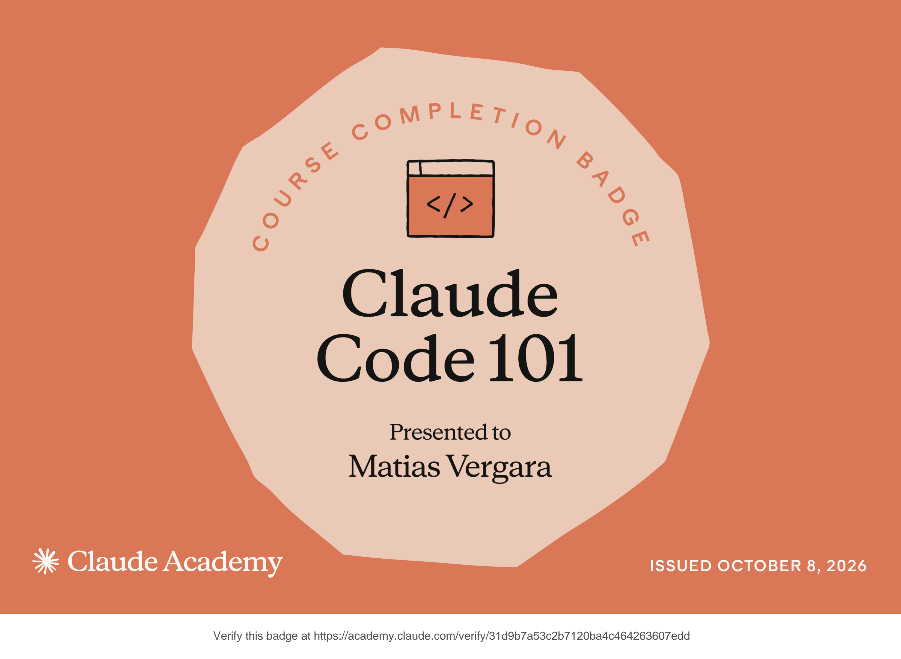

---

## 🧡 Todo empieza con Claude

Claude es mi herramienta favorita. Con Claude Code construyo, aprendo y pruebo ideas todos los días.

| 🧡 Claude Code | 🔌 Claude API | 🎓 Claude Academy |
|:---:|:---:|:---:|
| Mi editor de todos los días | Para crear mis propias herramientas | Mis cursos y certificaciones |

---

## 👋 Sobre mí

Soy un desarrollador de 14 años apasionado por la inteligencia artificial. Me gusta construir, probar y mejorar.

- 🧡 Construyo con Claude Code todos los días
- 🌐 Creo extensiones de Chrome, apps web y apps de Windows
- 🌱 Aprendiendo: modelos de IA desde cero
- 🤝 Abierto a colaborar en proyectos de IA

---

## 🚀 Proyectos

| Proyecto | Qué hace | Tecnologías | Enlace |
|---|---|---|---|
| **⚡ Autono** | Extensión de Chrome que funciona como agente de IA en el navegador. Responde sobre la página que ves y hace tareas de varios pasos solo. Usa Claude, Gemini y OpenAI. | JavaScript, Manifest V3, Python (FastAPI) | [Repo](https://github.com/MatiasV3B/Autono) |
| **🧡 Zylo AI** | Plataforma con una sola API, un chat y un constructor de apps para usar Claude, GPT, Gemini, DeepSeek y más con un solo saldo y precios públicos. | API compatible con OpenAI, Supabase, PostgreSQL | [Sitio](https://zyloai.net) |
| **🧪 CourseLab** | Cuaderno de estudio con IA para exámenes AP e IB. Trae los temarios oficiales, un tutor con IA que cita fuentes y aulas conectadas para profesores. | TypeScript, Tailwind CSS, Supabase | [Repo](https://github.com/MatiasV3B/CourseLab) · [Sitio](https://courselab-tool.vercel.app) |

🔎 Ver más sobre cada proyecto

### ⚡ Autono
- Panel lateral de Chrome con dos modos: chat y agente autónomo.
- Funciona con Claude, Gemini y OpenAI, por API o por terminal local.
- Atajo `Alt + Shift + C` y botón flotante al seleccionar texto.
- Código abierto, licencia MIT.

### 🧡 Zylo AI
- **Zylo API:** un endpoint para más de 40 modelos.
- **Zylo Chat:** espacio de trabajo con agentes, voz y navegador en la nube.
- **Zylo Code:** describes una app y la crea, la prueba y la despliega.
- Plan gratis sin tarjeta.

### 🧪 CourseLab
- 20 cursos AP de lanzamiento.
- Resúmenes en audio de cada unidad.
- Exámenes con versiones A/B/C para evitar copias.
- Estado: lista de espera, en desarrollo.

---

## 🛠️ Stack

**Hecho con Claude**

**Lenguajes**

**Herramientas y servicios**

**Otras herramientas de IA**

---

## 📊 Estadísticas

---

## 🏅 Certificaciones

| Curso | Emisor | Fecha | Verificación |
|---|---|---|---|
| Claude Code 101 | Claude Academy | 8 oct 2026 | [Verificar](https://academy.claude.com/verify/31d9b7a53c2b7120ba4c464263607edd) |

---

## 🎯 Metas

- [x] Dominar el desarrollo guiado por especificaciones
- [x] Presentar Autono en un hackatón
- [ ] Completar el curso "Construyendo con la API de Claude"
- [ ] Completar Claude Platform 101
- [ ] Completar Claude 101
- [ ] Crear un modelo de IA desde cero
- [ ] Más certificaciones

---

## 🤝 Colaboremos

Si te interesa un proyecto de IA, abre un issue en alguno de mis repos o escríbeme por GitHub.

